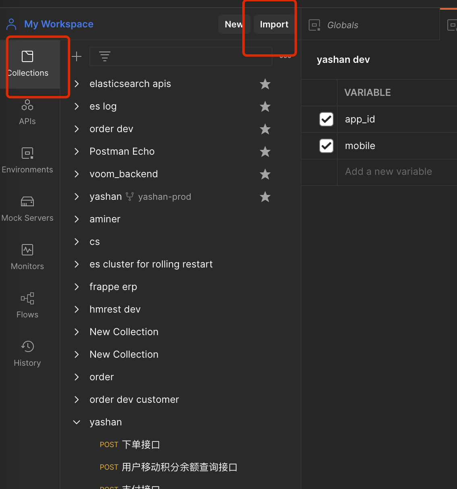
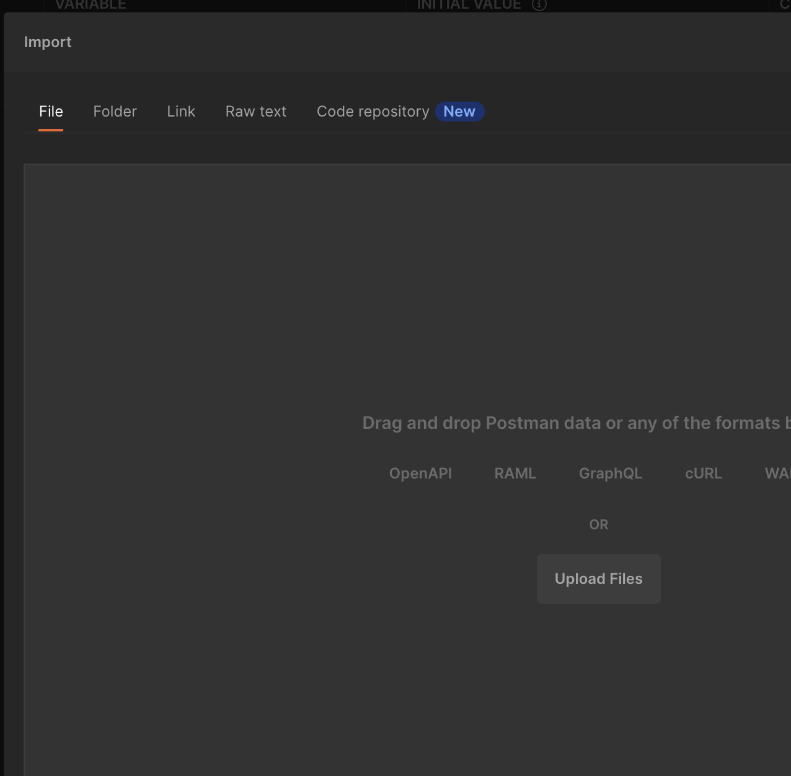
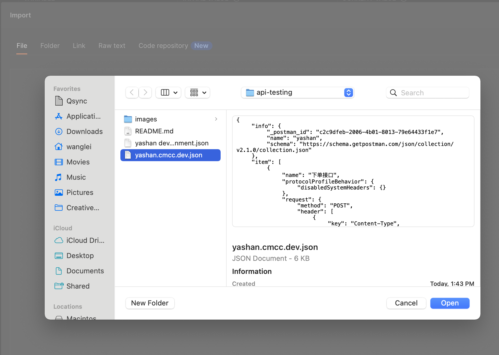
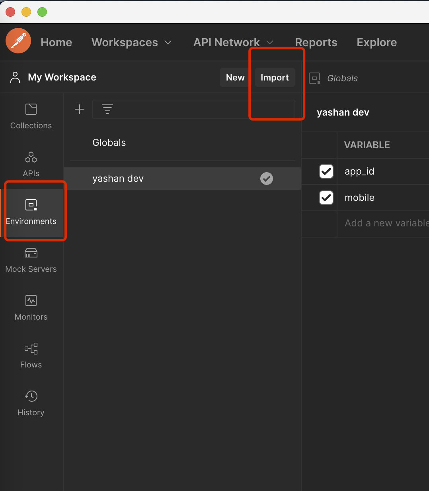
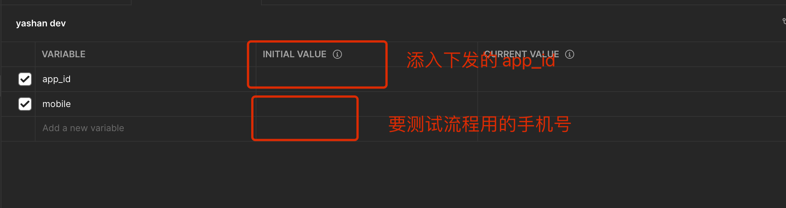
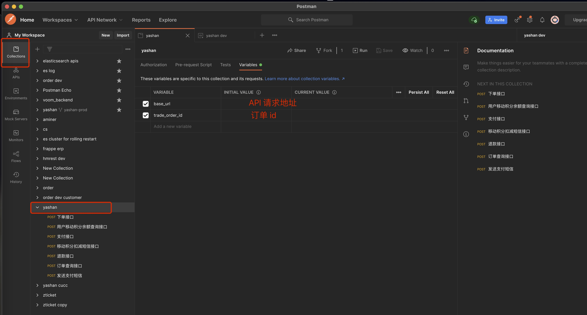

# api-testing
postman config

# 使用说明

- 确保在电脑上安装了[postman](https://www.postman.com/downloads/)
- 从 github 复制文件 `yashan dev.postman_environment.json` 和 `yashan.cmcc.dev.json`

## 导入 API

选择 `Collections` 后，选择 `import`

点击导入后，选择从文件导入, 并点击 `Upload Files`

选择文件 `yashan.cmcc.dev.json`

## 导入环境变量

选择 `Enviornments` 后，选择 `import` 

点击导入后，选择从文件导入, 并点击 `Upload Files`

选择文件 `yashan dev.postman_environment.json`

## 环境变量配置

需要进行 `app_id` 和 `mobile` 相关的配置。

## API 基本信息的配置

- 需要配置 `base_url` 作为请求 API 的地址
- trade_order_id 为订单 id，在调用下单 API 后会返回对应的信息，可以上图所示位置进行配置
